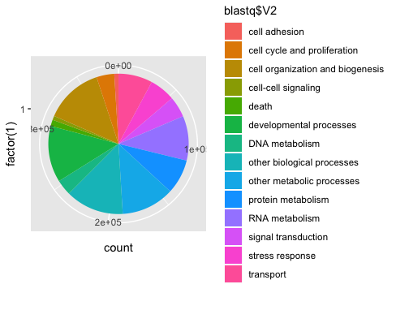

Today I BLASTn -ed Blue crab transcriptome with the assembled _C. bairdi_ transcriptome on Mox. I also finished up some more things in my BLAST to GO GO-slim notebook with uniprot/sprot. Additionally, I got some input from Steven on how best to create a poster for GSS (which is this THURSDAY) so that I can get some cool stuff on there, but not use too many words... which is always a problem I have. 

## BLASTn
I ran ```blastn``` on Mox. (GitHub Issue [#484](https://github.com/RobertsLab/resources/issues/484))

First I made a database with the blue crab transcriptome:    
[make_blastn_db.ipynb](https://github.com/fish546-2018/grace-Cbairdi-transcriptome/blob/master/notebooks/make_blastn_db.ipynb)

Then, I used this script to run blast on Mox:    
```
#!/bin/bash
## Job Name
#SBATCH --job-name=1113_Cbairdi_blast_01
## Allocation Definition
#SBATCH --account=srlab
#SBATCH --partition=srlab
## Resources
## Nodes
#SBATCH --nodes=1
## Walltime (days-hours:minutes:seconds format)
#SBATCH --time=3-20:30:00
## Memory per node
#SBATCH --mem=100G
##turn on e-mail notification
#SBATCH --mail-type=ALL
#SBATCH --mail-user=graceac9@uw.edu
## Specify the working directory for this job
#SBATCH --workdir=/gscratch/srlab/graceac9/analyses/1113-Cb-blast

# Load Python Mox module for Python module availability

module load intel-python3_2017


/gscratch/srlab/programs/ncbi-blast-2.6.0+/bin/blastn \
-query /gscratch/srlab/graceac9/query/library01/query.fa \
-db /gscratch/srlab/graceac9/blastdb/bluecrab/blastdb/bluecrab \
-max_target_seqs 1 \
-outfmt 6 \
-num_threads 28 \
-out 1113-cbairdi-bc-blast.tab
```
I just got an email saying the job finished. I used ```nano``` to look at the file. Here's some lines copy and pasted:                   
```
TRINITY_DN21432_c0_g1_i1        GEID01009651.1  79.268  246     26	17     $
TRINITY_DN21406_c0_g1_i2        GEID01112751.1  91.337  531     46	0      $
TRINITY_DN21488_c0_g1_i1        GEID01164208.1  100.000 31	0	0      $
TRINITY_DN21427_c0_g2_i3        GEID01037789.1  79.660  1293    236     22     $
TRINITY_DN21427_c0_g2_i2        GEID01037789.1  79.642  1174    212     22     $
TRINITY_DN21450_c0_g1_i1        GEID01013889.1  88.107  412     49	0      $
TRINITY_DN21468_c0_g2_i2        GEID01095198.1  96.429  56	2	0      $
TRINITY_DN5625_c2_g1_i3 GEID01080879.1  82.715  1886    310     16	410    $
TRINITY_DN5625_c2_g1_i4 GEID01080879.1  82.556  1886    313     16	410    $
TRINITY_DN5625_c2_g1_i5 GEID01080879.1  82.715  1886    310     16	378    $
TRINITY_DN5625_c2_g1_i2 GEID01080879.1  82.715  1886    310     16	410    $
TRINITY_DN5655_c0_g1_i1 GEID01030406.1  87.039  841     83	16	6      $
TRINITY_DN5655_c0_g2_i1 GEID01077734.1  94.900  451     14	5	1      $
TRINITY_DN5693_c0_g1_i1 GEID01052989.1  85.847  2805    362     15	454    $
TRINITY_DN5693_c0_g1_i3 GEID01052989.1  85.918  2805    363     14	454    $
TRINITY_DN5620_c0_g3_i1 GEID01164208.1  100.000 28	0	0	291    $
TRINITY_DN5670_c0_g2_i1 GEID01073871.1  82.257  1967    327     21	199    $
TRINITY_DN5672_c0_g1_i1 GEID01072687.1  89.773  88	7	2	1447   $
TRINITY_DN5634_c0_g1_i1 GEID01028809.1  86.521  549     52	16	180    $
TRINITY_DN5641_c1_g1_i1 GEID01073235.1  91.734  738     40	7	872    $
TRINITY_DN5666_c0_g4_i3 GEID01141318.1  83.922  1698    251     10	1      $
```

## BLAST to GO GOslim
[11052018-C_bairdi-blastn.ipynb](https://github.com/fish546-2018/grace-Cbairdi-transcriptome/blob/master/notebooks/11052018-C_bairdi-blastn.ipynb)

Finished up some things with that basing it on [Steven's notebook](https://github.com/sr320/nb-2018/blob/master/C_virginica/83-blast-2-slim.ipynb).

I took the final output from that file and moved it into my [grace-Cbairdi-transcriptome/analyses](https://github.com/fish546-2018/grace-Cbairdi-transcriptome/blob/master/analyses/Blastquery-GOslim.sorted) directory. 

I then used a new [R script](https://github.com/fish546-2018/grace-Cbairdi-transcriptome/blob/master/scripts/plots.R) to make a weird pie chart. 



Because I'm trying to have something to put on a poster by tomorrow afternoon, I'll just use excel, per Steven's suggestion. Will learn the R or Jupyter notebook way once I don't have a time crunch. 

## Trinity assembly stats using 
[Cbairdi_01_transrate.ipynb](http://localhost:8888/notebooks/Documents/GitHub/grace-Cbairdi-transcriptome/notebooks/Cbairdi_01_transrate.ipynb)

Will use some of these stats on my poster. 

```
################################
## Counts of transcripts, etc.
################################
Total trinity 'genes':	79739
Total trinity transcripts:	143172
Percent GC: 46.43

########################################
Stats based on ALL transcript contigs:
########################################

	Contig N10: 3801
	Contig N20: 2948
	Contig N30: 2431
	Contig N40: 2032
	Contig N50: 1696

	Median contig length: 608
	Average contig: 1010.52
	Total assembled bases: 144678598


#####################################################
## Stats based on ONLY LONGEST ISOFORM per 'GENE':
#####################################################

	Contig N10: 3659
	Contig N20: 2836
	Contig N30: 2306
	Contig N40: 1901
	Contig N50: 1539

	Median contig length: 479
	Average contig: 873.95
	Total assembled bases: 69687682
  ```
